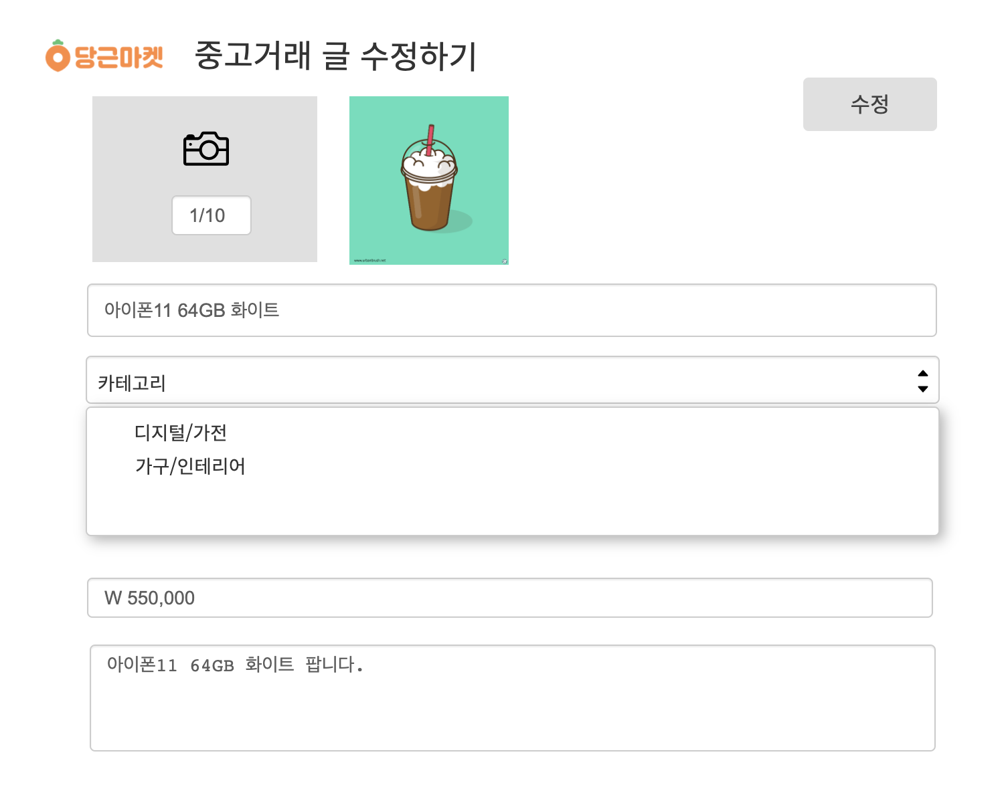

# carrotMarket

# 당근마켓 클론코딩

1. 계정 (승진)
   - 회원가입 (구글, 네이버)
   	- 소셜로그인 이용

   - 아이디,닉네임, 지역, 성별, 나이
   	- 지역 검색 시 API 사용

2. 거래 (민용)
   - 상품 등록 및 수정
    - 등록하는 기능
    - 사진, 제목, 가격, 설명, 카테고리, 동네

   - 수정하는 기능 (상세)
    - 사진, 제목, 가격, 설명, 카테고리, 동네

   - 판매중(목록)  , 거래 완료

3. 목록 (주성)
   - 상품 목록(검색)
    - 사진 제목 가격 동네 찜하기

   - 상세 화면
    - 사진 닉네임 제목 내용

   - 관심상품 목록

4. 게시판 (종영)
   - 동네생활 게시판
   - 글쓰기
   - 글목록
    - (검색조건)
   - 글상세
    - (댓글)
   - 글수정
   - 글삭제

